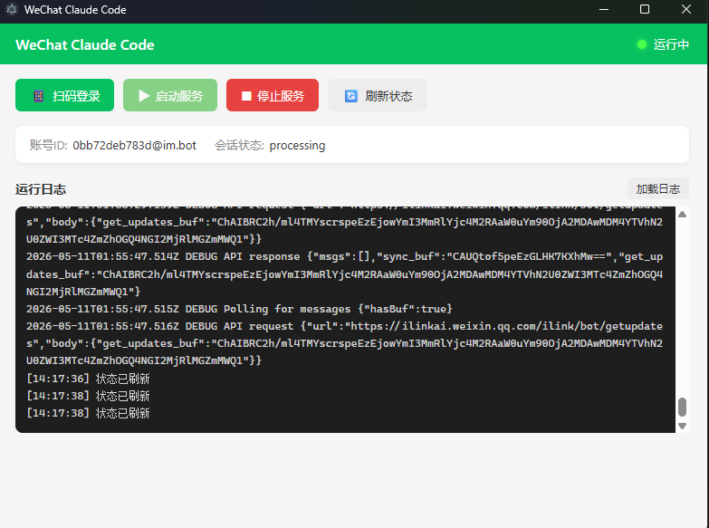

# wechat-claude-code

[](https://github.com/jiaweirobot/wx_claude_link/releases/latest)
[](https://github.com/jiaweirobot/wx_claude_link/actions/workflows/build.yml)
[](LICENSE)

**English** | [中文](README_zh.md)

A tool that bridges personal WeChat to your local Claude Code. Chat with Claude from your phone via WeChat — text, images, permission approvals, slash commands, all supported. Includes both CLI and **Electron desktop GUI**.

## Download

| Platform | Download | Note |
|----------|----------|------|
| Windows (x64) | [**Latest Release**](https://github.com/jiaweirobot/wx_claude_link/releases/latest) | `.exe` installer |

> macOS and Linux support coming soon.

Or download a specific version from the [Releases](https://github.com/jiaweirobot/wx_claude_link/releases) page.

## Screenshot



## Features

- **Desktop GUI** — Electron app with one-click login, start/stop, status, and log viewer
- **Real-time progress updates** — see Claude's tool calls (🔧 Bash, 📖 Read, 🔍 Glob…) as they happen
- **Thinking preview** — get a 💭 preview of Claude's reasoning before each tool call
- **Interrupt support** — send a new message mid-query to abort and redirect Claude
- **System prompt** — set a persistent prompt via `/prompt` (e.g. "Reply in Chinese")
- Text conversation with Claude Code through WeChat
- Image recognition — send photos for Claude to analyze
- Permission approval — reply `y`/`n` in WeChat to approve Claude's tool use
- Slash commands — `/help`, `/clear`, `/model`, `/prompt`, `/status`, `/skills`, and more
- Launch any installed Claude Code skill from WeChat
- Cross-platform — **Windows**, macOS, Linux
- Session persistence — resume conversations across messages
- Rate-limit safe — automatic exponential backoff on WeChat API throttling

## Prerequisites

- Node.js >= 18
- Personal WeChat account (QR code binding required)
- [Claude Code](https://docs.anthropic.com/en/docs/claude-code) with `@anthropic-ai/claude-agent-sdk` installed
  > **Note:** The SDK supports third-party API providers (e.g. OpenRouter, AWS Bedrock, custom OpenAI-compatible endpoints) — set `ANTHROPIC_BASE_URL` and `ANTHROPIC_API_KEY` accordingly.

## Installation

```bash
git clone https://github.com/jiaweirobot/wx_claude_link.git
cd wx_claude_link
npm install
```

`postinstall` automatically compiles TypeScript via `tsc`.

## Quick Start

### Option A: Desktop GUI (Recommended)

```bash
npm run electron
```

Click **"扫码登录"** to scan QR code, then **"启动服务"** to start the bridge.

### Option B: CLI

#### 1. Setup (first time only)

```bash
npm run setup
```

A QR code image will open — scan it with WeChat. Then configure your working directory.

#### 2. Start the service

```bash
# Foreground
node dist/main.js start

# Background daemon
node scripts/daemon.js start
```

#### 3. Manage the daemon

```bash
node scripts/daemon.js status    # Check if running
node scripts/daemon.js stop      # Stop the daemon
node scripts/daemon.js restart   # Restart
node scripts/daemon.js logs      # View recent logs
```

## WeChat Commands

| Command | Description |
|---------|-------------|
| `/help` | Show available commands |
| `/clear` | Clear current session (start fresh) |
| `/reset` | Full reset including working directory |
| `/model <name>` | Switch Claude model |
| `/permission <mode>` | Switch permission mode |
| `/prompt [text]` | View or set a system prompt appended to every query |
| `/status` | View current session state |
| `/cwd [path]` | View or switch working directory |
| `/skills` | List installed Claude Code skills |
| `/history [n]` | View last N chat messages |
| `/compact` | Start a new SDK session (clear token context) |
| `/undo [n]` | Remove last N messages from history |
| `/<skill> [args]` | Trigger any installed skill |

## Permission Approval

When Claude requests to execute a tool, you'll receive a permission request in WeChat:

- Reply `y` or `yes` to allow
- Reply `n` or `no` to deny
- No response within 120 seconds = auto-deny

You can switch permission mode with `/permission <mode>`:

| Mode | Description |
|------|-------------|
| `default` | Manual approval for each tool use |
| `acceptEdits` | Auto-approve file edits, other tools need approval |
| `plan` | Read-only mode, no tools allowed |
| `auto` | Auto-approve all tools (dangerous mode) |

## How It Works

```
WeChat (phone) ←→ ilink bot API ←→ Node.js bridge ←→ Claude Code SDK (local)
                                         ↑
                              CLI or Electron GUI
```

- The bridge long-polls WeChat's ilink bot API for new messages
- Messages are forwarded to Claude Code via `@anthropic-ai/claude-agent-sdk`
- Tool calls and thinking previews are streamed back as Claude works
- Responses are sent back to WeChat with automatic rate-limit retry
- Desktop GUI provides visual control (login, start/stop, status, logs)

## Project Structure

```
src/
├── daemon.ts            # Core daemon controller (start/stop/getStatus)
├── login-flow.ts        # QR login flow (decoupled from UI)
├── main.ts              # CLI entry point
├── session.ts           # Session state persistence
├── permission.ts        # Permission broker (y/n approval with timeout)
├── config.ts            # Config file management
├── claude/
│   ├── provider.ts      # Claude Agent SDK wrapper (streaming, permissions)
│   └── skill-scanner.ts # Discover installed skills
├── commands/
│   ├── router.ts        # Slash command dispatcher
│   └── handlers.ts      # Command implementations
└── wechat/
    ├── api.ts           # ilink bot HTTP client
    ├── monitor.ts       # Long-poll message loop
    ├── send.ts          # Outbound message sender
    ├── login.ts         # QR code login protocol
    ├── media.ts         # Image download + decrypt
    └── ...              # Types, crypto, CDN, accounts

electron/
├── main.cjs             # Electron main process (IPC handlers)
├── preload.cjs          # Secure IPC bridge
├── index.html           # Desktop UI
├── renderer.js          # Frontend logic
└── styles.css           # WeChat-green themed styles
```

## Data

All data is stored in `~/.wechat-claude-code/`:

```
~/.wechat-claude-code/
├── accounts/       # WeChat account credentials (one JSON per account)
├── config.env      # Global config (working directory, model, permission mode, system prompt)
├── sessions/       # Session data (one JSON per account)
├── get_updates_buf # Message polling sync buffer
└── logs/           # Rotating logs (daily, 30-day retention)
```

## Architecture

See [ARCHITECTURE.md](ARCHITECTURE.md) for detailed runtime logic, message flow diagrams, and module dependency analysis.

## Development

```bash
npm run dev       # Watch mode — auto-compile on TypeScript changes
npm run build     # Compile TypeScript
npm run electron  # Launch desktop app
```

## License

[MIT](LICENSE)
